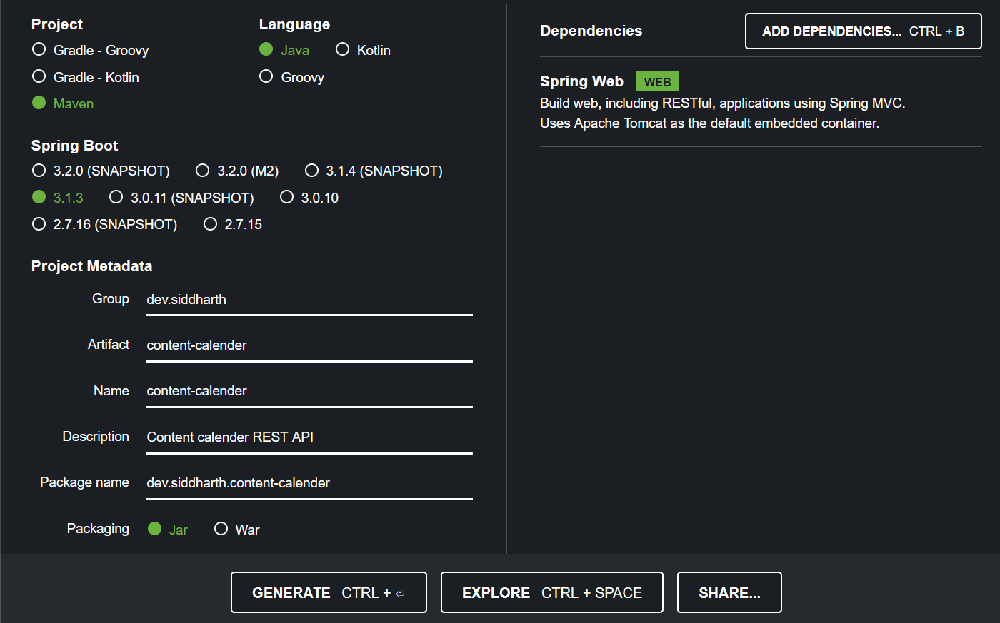

# SpringBoot

- First head to start.spring.io

## Annotations
In Spring Boot, annotations are a way to provide metadata to the Spring framework to configure various aspects of your application. Annotations are used to define the behavior of classes, methods, or fields in a concise and declarative manner. They help Spring Boot automatically configure and manage components and services within your application. Here are some common annotations used in Spring Boot:

    @SpringBootApplication:
        This annotation is typically placed on the main class of a Spring Boot application. It combines several other annotations, such as @Configuration, @EnableAutoConfiguration, and @ComponentScan, to enable Spring Boot's auto-configuration and component scanning.

    @Controller, @RestController:
        These annotations are used to define Spring MVC controllers. @Controller is used for traditional MVC controllers, while @RestController is used for RESTful web services and combines @Controller and @ResponseBody.

    @Service:
        This annotation is used to define a service class in Spring. Services are typically used to encapsulate business logic.

    @Repository:
        This annotation is used to define a data repository class. It is often used with Spring Data JPA or other data access technologies.

    @Autowired:
        This annotation is used for automatic dependency injection. It tells Spring to inject a bean of a specified type into the annotated field, constructor, or method.

    @Component:
        This is a generic stereotype annotation used to define a Spring-managed component. It is often used when no specific stereotype annotation (e.g., @Service, @Repository) is more appropriate.

    @Configuration:
        This annotation is used to define a Java-based configuration class. It can be used to define beans and their dependencies.

    @Value:
        This annotation is used to inject values from properties files or application.yml (YAML) files into fields in a Spring component.